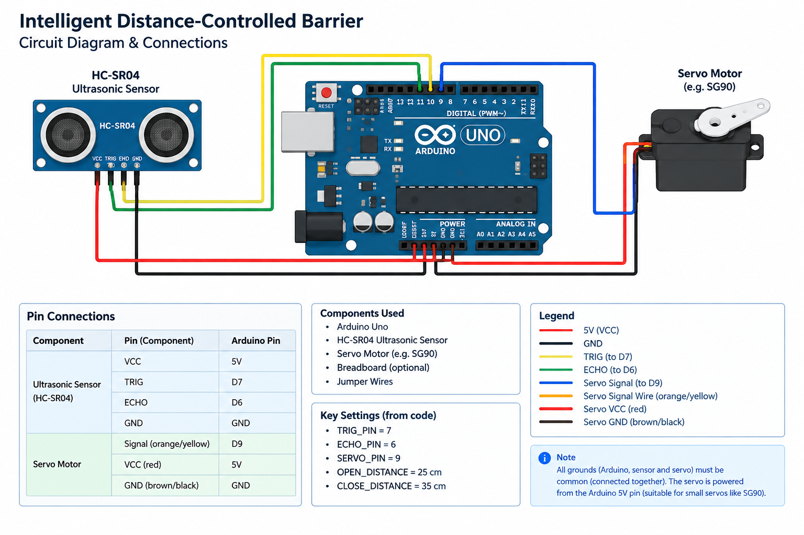

# Circuit Diagram & Connections

## Components

- Arduino
- Ultrasonic sensor
- Servo motor
- Breadboard
- Jumper wires

## Connections

### Ultrasonic Sensor

| Sensor Pin | Arduino |
|-  --|---|
| VCC | 5V |
| GND | GND |
| TRIG | D7 |
| ECHO | D6   |

### Servo Motor

| Servo Wire/Pin | Arduino |
|---|---|
| VCC | 5V |
| GND | GND |
| Signal | D9   |

## Circuit Diagram

